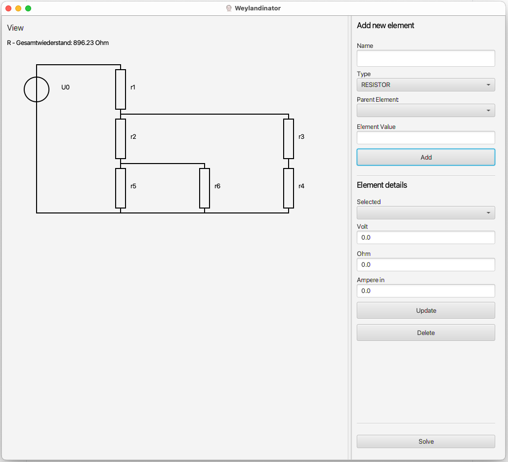

# Weylandinator ©

[](https://github.com/MrF3lix/weylandinator/actions?query=workflow%3ACI)
[](https://github.com/MrF3lix/weylandinator/issues)
[](https://sonarcloud.io/dashboard?id=MrF3lix_weylandinator)


The Weylandinator is a tool to simulate circuits with voltage sources, resistors and loads.

## Ideas

- Responsibilities
  - UI
    - Schaltung definieren
      - Spannungsquelle
      - Wiederstände
      - Verbraucher
  - Logik
    - Komplettwiederstand berechnen
    - Spannungsabfall pro Wiederstand

## Installation

- Download the latest installer from the Release page.
- Execute the installer.
- Open the Weylandinator.

## How to use it

1. Open the Weylandinator

1. Add as many elements as you need
1. Add the parameter that you have for each element
1. Press "Solve" to calculate the remaining parameters.

## Sample Circuits

This is a sample circuit that could be represented using the Weylandinator.


## Sample Data

A circuit is stored in a tree like structure. So each Element can have multiple child elements.

By Default there's a RootElement that stores all the other elements.

This sample shows a circuit with two parallel resistors and a single voltage source.

```JSON
"circuit": {
    "name": "RootElement"
    "childElement": [
        {
            "type": "CircuitElementType.VoltageSource",
            "name": "U_0",
            "voltage": 5,
            "current": 0,
            "resistance": 0,
            "childElement": [
                {
                    "type": "CircuitElementType.Resistor",
                    "name": "R_1",
                    "voltage": 0,
                    "current": 0,
                    "resistance": 1000,
                    "childElement": []
                },
                {
                    "type": "CircuitElementType.Resistor",
                    "name": "R_2",
                    "voltage": 0,
                    "current": 0,
                    "resistance": 500,
                    "childElement": []
                }
            ]
        }
    ]
}
